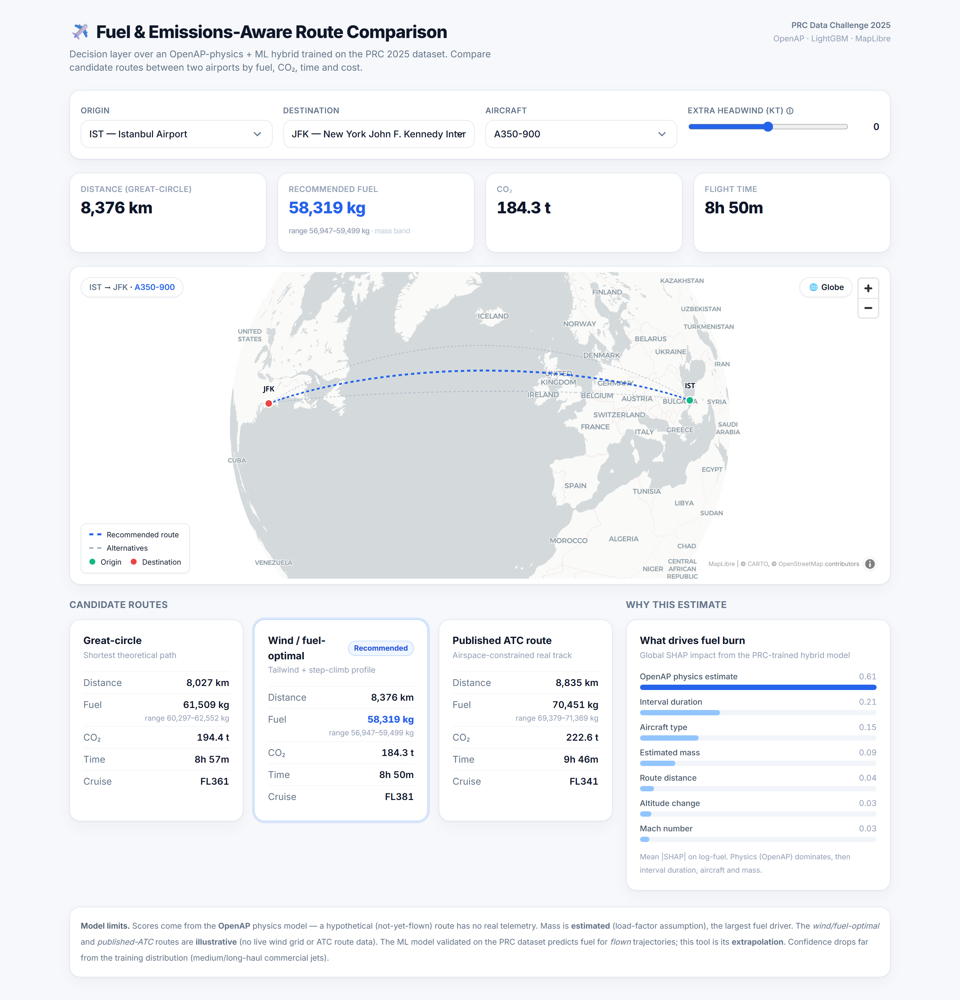
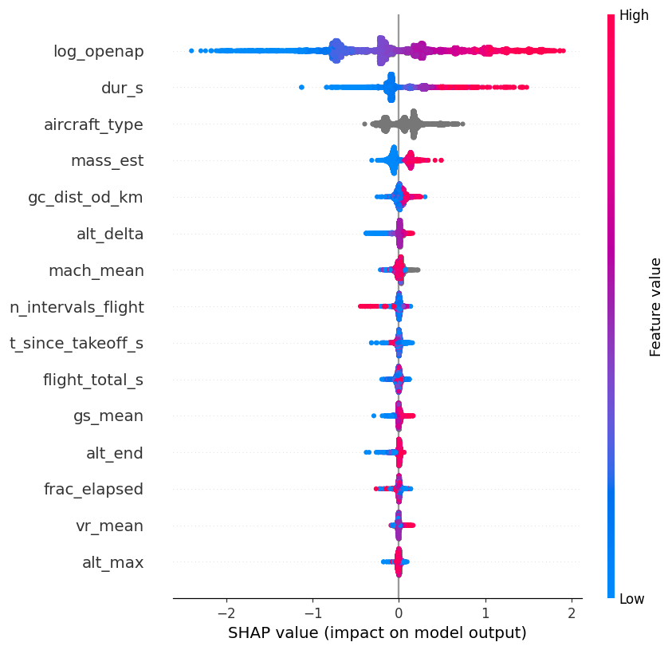

# ✈️ Fuel & Emissions-Aware Flight Route Decision Support

[](https://huggingface.co/spaces/yusufkilicc/fuel-flight-routing)

**🔗 Try it live:** **[open the app ↗](https://yusufkilicc-fuel-flight-routing.hf.space)** · or view it on the [Hugging Face Space](https://huggingface.co/spaces/yusufkilicc/fuel-flight-routing)

Predict per-interval **fuel burn** from real flight trajectories, then turn that
model into a **route decision-support tool** that scores candidate routes between
any two airports by fuel, CO₂, time and cost.

Built on the [PRC Data Challenge 2025](https://ansperformance.eu/study/data-challenge/dc2025/)
dataset (EUROCONTROL × OpenSky Network).

> **Prediction → interpretation → decision → product.** A hybrid OpenAP-physics +
> LightGBM model predicts fuel; SHAP explains it; a multi-scenario engine turns it
> into route recommendations; a 3D-globe web app makes it usable.

[](https://yusufkilicc-fuel-flight-routing.hf.space)

---

## Why this project

Fuel burn ties a technical ML problem directly to **cost and CO₂** — the heart of
airline operations. The dataset is real (ADS-B + ACARS), noisy, and large
(11k flights, 131k labeled intervals), so it is as much a **data-engineering**
problem as a modeling one.

## Key results

| | Out-of-fold RMSE (kg) |
|---|---|
| Naïve median baseline | 953 |
| LightGBM baseline (telemetry features) | 258 |
| **+ OpenAP physics hybrid** | **252** |

- Target `fuel_kg` is near-perfectly **log-normal** (log-skew 0.08) → trained on `log(fuel)`.
- **~35 % of intervals have no ADS-B coverage** (oceanic cruise) yet carry **~52 % of
  total fuel mass** → a pure-ML model is blind there. The **OpenAP physics backbone**
  is what makes those intervals (and hypothetical routes) predictable.
- **SHAP** shows the OpenAP estimate is the #1 driver (mean|SHAP| 0.62), then interval
  duration, aircraft type and mass — a clean, physically sensible story.



## Architecture

```
 Interface   3D-globe web app (FastAPI + MapLibre + Tailwind)
     ▲        select A→B + aircraft → map + scenario comparison
 Decision    candidate routes (great-circle / wind-optimal / ATC)
     ▲        → score each → multi-criteria ranking
 Prediction  OpenAP physics  ──►  baseline fuel for ANY condition
   (hybrid)   LightGBM        ──►  corrects it where telemetry exists
```

For hypothetical (not-yet-flown) routes there is no telemetry, so **OpenAP is the
backbone** and ML refines it where observations exist — this resolves the
train-vs-inference feature gap honestly.

## Quick start

The web app **runs out-of-the-box** — the small demo data it needs
(`data/apt.parquet`, `data/flightlist_train.parquet`) and the trained models
are bundled. No download or configuration required.

### Easiest — one command (creates a venv, installs, opens the browser)

```text
Windows:        run.bat
macOS / Linux:  ./run.sh
```

First run sets everything up (a local `.venv`) and then opens
`http://localhost:8600` automatically once the server is ready. Subsequent runs
start instantly.

### Manual

```bash
pip install -r requirements-web.txt   # web app only (fast)
python start_app.py                   # serves + opens browser → http://localhost:8600
# or: python web/web_app.py           # serve without auto-opening the browser

# (optional) Streamlit prototype
streamlit run web/app_streamlit.py
```

### Docker

```bash
docker build -t prc-fuel-routing .
docker run -p 8600:8600 prc-fuel-routing
```

To **reproduce the modeling pipeline** you need the full trajectory dataset
(see [DATA.md](DATA.md)) in `./data` or via `PRC_DATA_DIR`:

```bash
python src/eda_phase0.py                 # exploratory analysis
python src/feature_pipeline.py train     # interval features (set A)
python src/openap_baseline.py train      # add OpenAP physics + mass estimate
python src/train_hybrid.py               # hybrid model + CV
python src/train_phase3.py               # SHAP + quantile bands + save models

# generate a HYBRID submission (run the feature + OpenAP steps for the split first)
python src/feature_pipeline.py rank
python src/openap_baseline.py  rank
python src/submit.py           rank      # → submission_rank_hybrid.parquet
```

Run the test suite:

```bash
pip install -r requirements-dev.txt
pytest -q
```

## Project structure

```
prc2025-fuel-routing/
├── src/        modeling pipeline (EDA → features → OpenAP → train → submit) + route engine
├── web/        web_app.py (FastAPI + MapLibre globe) · app_streamlit.py (prototype)
├── models/     saved LightGBM P10/P50/P90 + SHAP importances
├── tests/      pytest smoke tests (engine + API)
├── data/       bundled demo data (apt + flightlist) — full data via DATA.md
├── docs/       screenshots, SHAP summary, REVIEW.md (code review + roadmap)
├── REPORT.md   full case study (method, validation, findings, limits)
└── DATA.md     how to obtain the dataset
```

Configuration: `PORT`/`HOST` env vars for the web app; `PRC_DATA_DIR` to point at a
full dataset. CI runs byte-compile + pytest on every push (`.github/workflows/ci.yml`).

## Honest limitations

This is a portfolio/decision-support project, not a certified operational tool.

- Aircraft **mass is estimated** (load-factor assumption) — the largest fuel driver.
- Route-engine fuel is an **OpenAP estimate** (~10–20 % vs airline actuals; a small
  empirical calibration is applied and documented in code).
- The *wind/fuel-optimal* and *published-ATC* scenarios are **illustrative** (no live
  wind grid or real ATC routings).
- The ML model is validated on *flown* trajectories; using it for hypothetical routes
  is an **extrapolation** whose confidence drops outside the training distribution.

See [REPORT.md](REPORT.md) for the full methodology, validation and findings.

## Credits

- Data: PRC Data Challenge 2025 — EUROCONTROL Performance Review Commission & OpenSky Network.
- Physics: [OpenAP](https://github.com/junzis/openap) (Junzi Sun).
- License: MIT (code only) — see [LICENSE](LICENSE).
